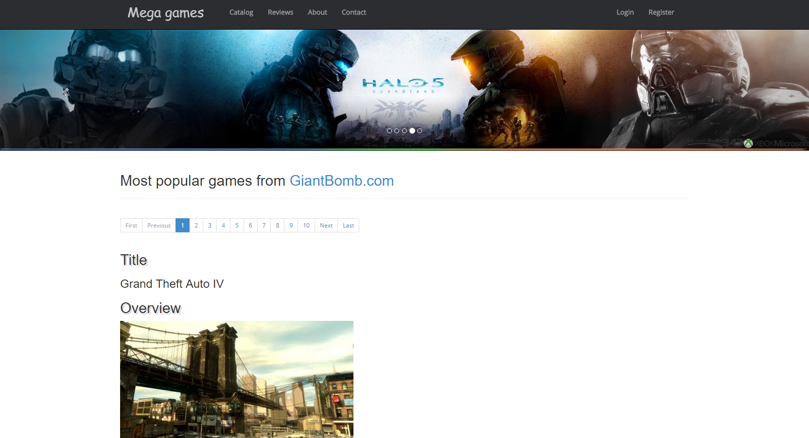
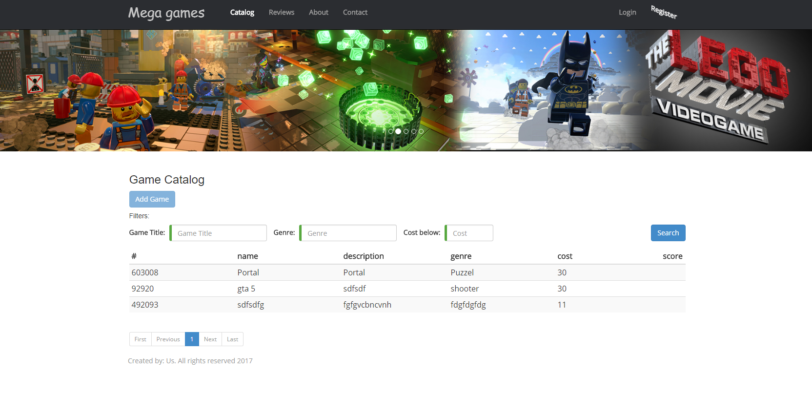
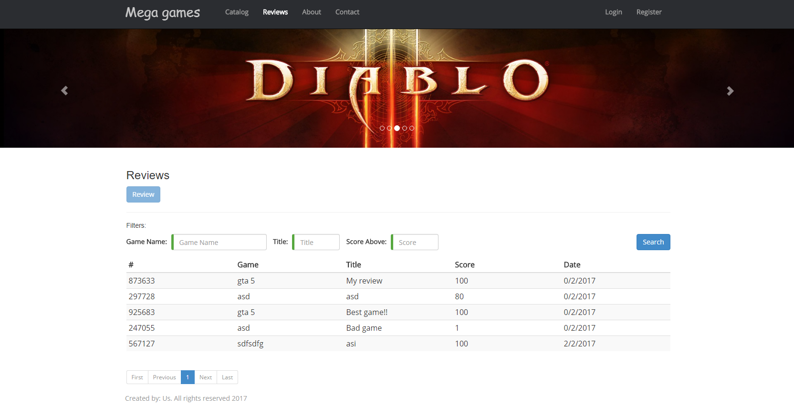
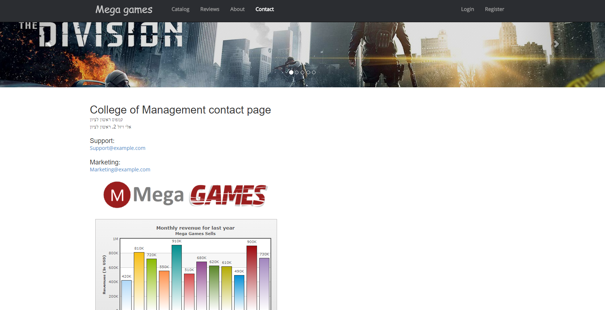

# 

  

## Description

Project using MEAN (MongoDB,Express,Angular,Node.js) 

## Install

Install Node.js https://nodejs.org/en/download/package-manager/#windows   
Install MongoDB https://docs.mongodb.com/manual/installation/   
clone project  
Run run.bat file 
Open browser on localhost:3000  

## Screenshots

  

  

  

  
